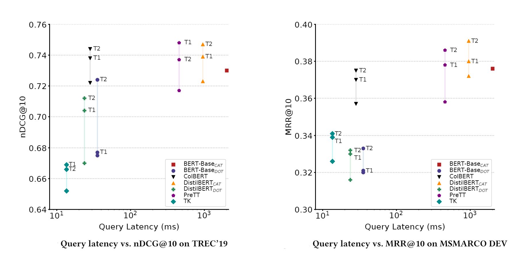

# Neural IR: Cross-Architecture Knowledge Distillation

Welcome 🙌 to the hub-repo of our paper:

*Improving Efficient Neural Ranking Models with Cross-Architecture Knowledge Distillation*  Sebastian Hofstätter, Sophia Althammer, Michael Schröder, Mete Sertkan and Allan Hanbury

https://arxiv.org/abs/2010.02666

**tl;dr** We utilize an ensemble of BERT<sub>CAT</sub> models (the vanilla BERT passage re-ranking model) to teach & improve a range of other more efficient architectures for (re-)ranking with a Margin-MSE loss. We publish the teacher training files for everyone to use here 🎉 We are sure the community can do very cool things with these training files 😊

If you have any questions, suggestions, or want to collaborate please don't hesitate to get in contact with us via [Twitter](https://twitter.com/s_hofstaetter) or mail to s.hofstaetter@tuwien.ac.at


*The knowledge distillation workflow; we provide the "Result Store" in this repo.*

**Please cite our work as:**
````
@misc{hofstaetter2020_crossarchitecture_kd,
      title={Improving Efficient Neural Ranking Models with Cross-Architecture Knowledge Distillation}, 
      author={Sebastian Hofst{\"a}tter and Sophia Althammer and Michael Schr{\"o}der and Mete Sertkan and Allan Hanbury},
      year={2020},
      eprint={2010.02666},
      archivePrefix={arXiv},
      primaryClass={cs.IR}
}
````
## Pre-Trained Models

We provide the following full-trained 6 layer DistilBERT-based models (trained with Margin-MSE using a 3 teacher BERT<sub>CAT</sub> ensemble (T2 in the paper) on MSMARCO-Passage) via the HuggingFace model hub:

* **BERT<sub>DOT</sub>** (re-ranking and dense-retrieval model): https://huggingface.co/sebastian-hofstaetter/distilbert-dot-margin_mse-T2-msmarco

    The DistilBERT architecture should work as plug 'n play everywhere you use the transformer library. For a minimal usage example of the BERT<sub>DOT</sub> model check out our notebook [minimal_bert_dot_usage_example.ipynb](minimal_bert_dot_usage_example.ipynb) here or [](https://colab.research.google.com/github/sebastian-hofstaetter/neural-ranking-kd/blob/master/minimal_bert_dot_usage_example.ipynb)

* **ColBERT** (re-ranking and dense-retrieval model): https://huggingface.co/sebastian-hofstaetter/colbert-distilbert-margin_mse-T2-msmarco
    
    For a minimal usage example of our ColBERT checkpoint check out our notebook [minimal_colbert_usage_example.ipynb](minimal_colbert_usage_example.ipynb) here or [](https://colab.research.google.com/github/sebastian-hofstaetter/neural-ranking-kd/blob/master/minimal_colbert_usage_example.ipynb)

* **BERT<sub>CAT</sub>** (re-ranking model): https://huggingface.co/sebastian-hofstaetter/distilbert-cat-margin_mse-T2-msmarco

    For a minimal usage example of the BERT<sub>CAT</sub> model check out our notebook [minimal_bert_cat_usage_example.ipynb](minimal_bert_cat_usage_example.ipynb) here or [](https://colab.research.google.com/github/sebastian-hofstaetter/neural-ranking-kd/blob/master/minimal_bert_cat_usage_example.ipynb)

* **PreTTR** (re-ranking model): https://huggingface.co/sebastian-hofstaetter/prettr-distilbert-split_at_3-margin_mse-T2-msmarco
    
    For a minimal usage example of our PreTTR checkpoint check out our notebook [minimal_prettr_usage_example.ipynb](minimal_prettr_usage_example.ipynb) here or [](https://colab.research.google.com/github/sebastian-hofstaetter/neural-ranking-kd/blob/master/minimal_prettr_usage_example.ipynb)


If you have a specific request for a pre-trained model from the paper, please create an issue here :) 

## Teacher Training Files (MSMARCO-Passage)

We publish the training files without the text content instead using the ids from MSMARCO; for the text content please download the files from [the MSMARCO Github Page](https://github.com/microsoft/MSMARCO-Passage-Ranking#data-information-and-formating) and use the helper script (teacher_id_to_text.py) in this repo to expand the id files with the fulltext, if necessary. 

The teacher files (using the data from "Train Triples Small" with ~40 million triples) with the format ``pos_score neg_score query_id pos_passage_id neg_passage_id`` (with tab separation) are:

- (T1) BERT-Base<sub>CAT</sub>
- (T2) Mean-Ensemble of BERT-Base<sub>CAT</sub> + BERT-Large<sub>CAT</sub> + ALBERT-Large<sub>CAT</sub>

available at Zenodo: https://zenodo.org/record/4068216

## Source Code

The full source-code for our paper is here, as part of our matchmaker library: https://github.com/sebastian-hofstaetter/matchmaker

We have getting started guides for training teachers & students, as well as a range of other possibilities surrounding the Margin-MSE loss.

## Cross Architecture Knowledge Distillation

The latency of neural ranking models at query time is largely dependent on the architecture and deliberate choices by their designers to trade-off effectiveness for higher efficiency. This focus on low query latency of a rising number of efficient ranking architectures make them feasible for production deployment. In machine learning an increasingly common approach to close the effectiveness gap of more efficient models is to apply knowledge distillation from a large teacher model to a smaller student model. We find that different ranking architectures tend to produce output scores in different magnitudes. Based on this finding, we propose a cross-architecture training procedure with a margin focused loss (Margin-MSE), that adapts knowledge distillation to the varying score output distributions of different BERT and non-BERT ranking architectures. We apply the teachable information as additional fine-grained labels to existing training triples of the MSMARCO-Passage collection. We evaluate our procedure of distilling knowledge from state-of-the-art concatenated BERT models to four different efficient architectures (TK, ColBERT, PreTT, and a BERT CLS dot product model). We show that across our evaluated architectures our Margin-MSE knowledge distillation significantly improves their effectiveness without compromising their efficiency. 



*Efficiency vs. effectiveness on two query sets and their main effectiveness metrics, T1 and T2 are the knowledge distillation trained models with BERT-Base<sub>CAT</sub> (T1) and the ensemble (T2)*
